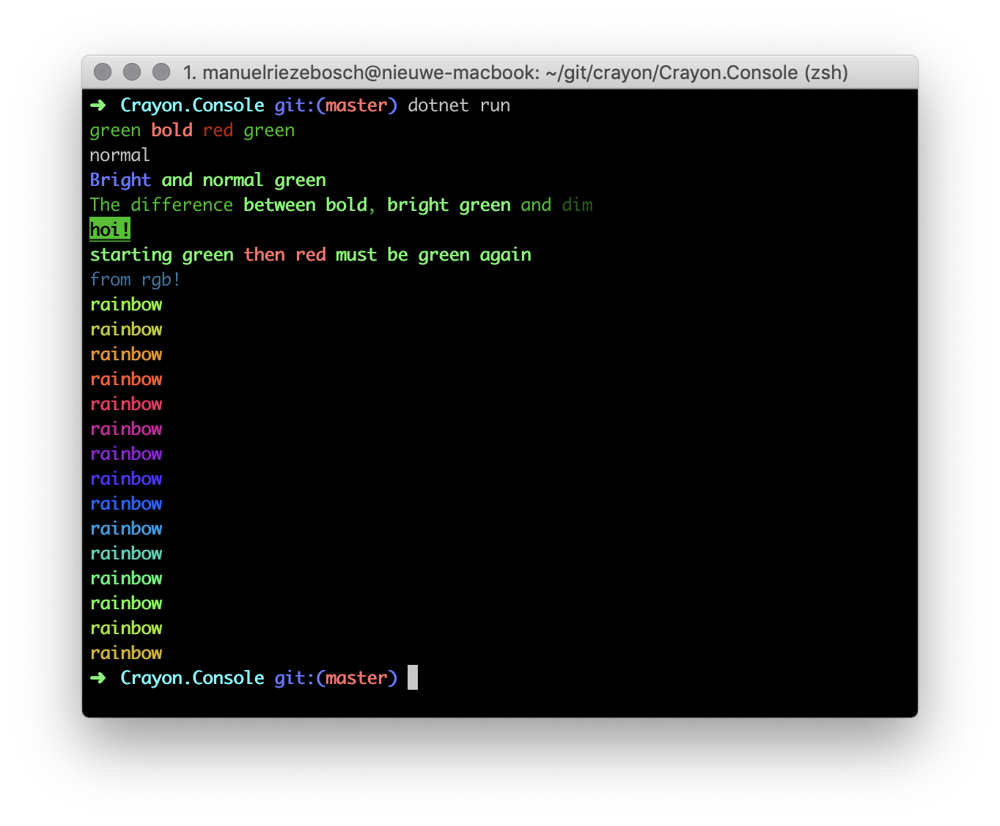

[](https://ci.appveyor.com/project/riezebosch/crayon/branch/master)
[](https://www.nuget.org/packages/Crayon/)

# Crayon
An easy peasy tiny library for coloring console output in inline strings using ANSI escape codes.

## Examples

```c#
Console.WriteLine(Output.Green($"green {Output.Red($"{Output.Bold("bold")} red")} green"));
Console.WriteLine("normal");
Console.WriteLine(Output.BrightBlue($"Bright {Output.Green("and normal green")}"));
Console.WriteLine(Output.Green($"The difference {Output.Bold("between bold")} and {Output.BrightGreen("bright green")}"));
Console.WriteLine(Output.Green().Bold().Underline().Reversed().Text("hoi!"));
Console.WriteLine(Output.Bold().Green().Text($"starting green {Output.Red("then red")} must be green again"));
```



## Two modes

The static methods accepting string input `Output.Red("input")` return formatted string output. This also works with nested interpolated strings `Output.Red($"input {Output.Bold("bold")}")`.

Or building up a formatter using `Output.Bold().Red().Text("input")` where the string is only returned after closing with the `Text` method. This can also be mixed with interpolated strings.

## Rainbows 🌈

Thanks to [DevinR528](https://github.com/devinRagotzy) we now have rainbows!

```c#
var rainbow = new Rainbow(0.5);
for(var i = 0; i < 15; i++)
{
    Console.WriteLine(rainbow.Next().Bold().Text("rainbow"));
}
```

## How compatible is it?

It works fine on everything except for older Windows versions.

## Credits

My journey for using ANSI codes in C# first brought me here: https://www.jerriepelser.com/blog/using-ansi-color-codes-in-net-console-apps/

The ANSI coloring details was inspired by this blog post: http://www.lihaoyi.com/post/BuildyourownCommandLinewithANSIescapecodes.html

The code for enabling ANSI colors feature on Windows was borrowed from this issue: https://github.com/Microsoft/WSL/issues/1873 

No greater compliment than someone [taking your work for inspiration](https://github.com/silkfire/Pastel). In return I peaked into his code for the RGB support!